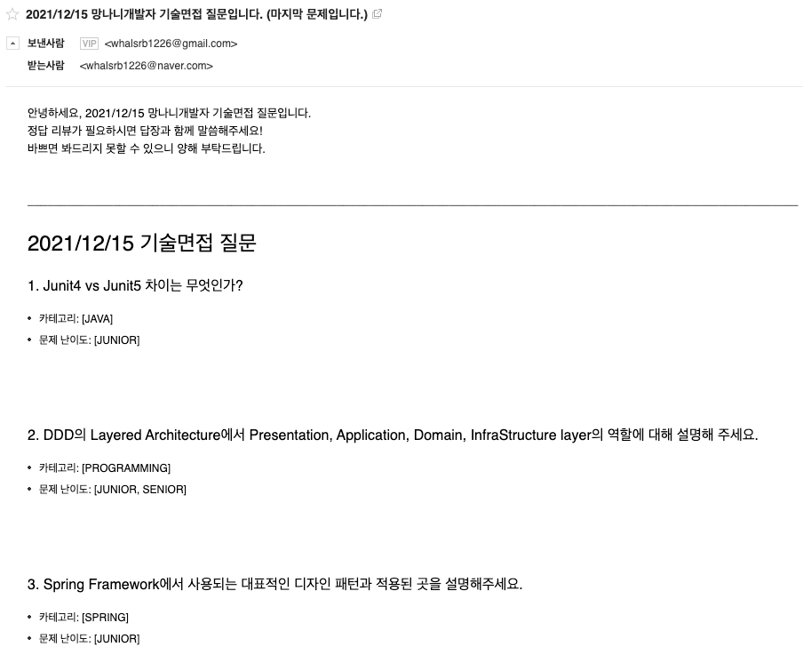

# 개발자 기술 면접 준비를 위한 문제 구독 서비스

## Introduce

### What
개발자가 되기 위해 또는 새로운 회사로 이직하기 위해 기술 면접 준비는 필수입니다.
많은 분들이 기술 면접을 준비하는 과정에서 조금이나마 도움이 되었으면 하는 마음으로 기술 문제 질문을 메일로 발송해주는 서비스를 구성해보았습니다.

### Category
위 서비스는 기술 면접 카테고리를 다음과 같이 분류하였습니다.
- JAVA: Java 언어에 대한 질문
- SPRING: Spring 프레임워크에 대한 질문
- SERVER: 서버 사이드 프로그래밍에 대한 질문
- NETWORK: 네트워크에 대한 질문
- OPERATING_SYSTEM: 운영체제에 대한 질문
- DATABASE: 데이터베이스에 대한 질문
- PROGRAMMING: 프로그래밍 전반에 대한 질문
- DATA_STRUCTURE: 자료구조에 대한 질문
- ALGORITHM: 알고리즘에 대한 질문 
- PROBLEM_SOLVING: 문제 해결 능력과 관련된 질문
- CULTURE: 문화 적합성과 관련된 질문
- EXPERIENCE: 프로젝트 경험과 관련된 질문
- PERSONALITY: 면접자 개인에 관련된 질문

### Level
위 서비스는 등급을 다음과 같이 분류하였습니다.
- NEW: 첫 직장을 준비하는 신입 개발자
- JUNIOR: 이직을 준비하는 주니어 개발자
- SENIOR: 이직을 준비하는 시니어 개발자

### QuizList
- 모든 면접 질문은 기출 문제들 중에서 빈출 문제들만을 엄선하여 수집하였고, 직접 등급을 나누었습니다.
- 제가 Spring, 백엔드 개발자인지라 다른 영역(안드로이드, 프론트엔드, 인공지능 등)에 대한 문제는 수집하지 못했습니다.

### HOW
- 본인의 이메일 및 등급을 블로그 댓글로 알려주면 사용자 등록을 해줍니다.
- 매주 일요일 새벽 1시에 3가지 문제가 랜덤으로 발송됩니다.
- 주어진 문제를 해결해나가면 됩니다.

